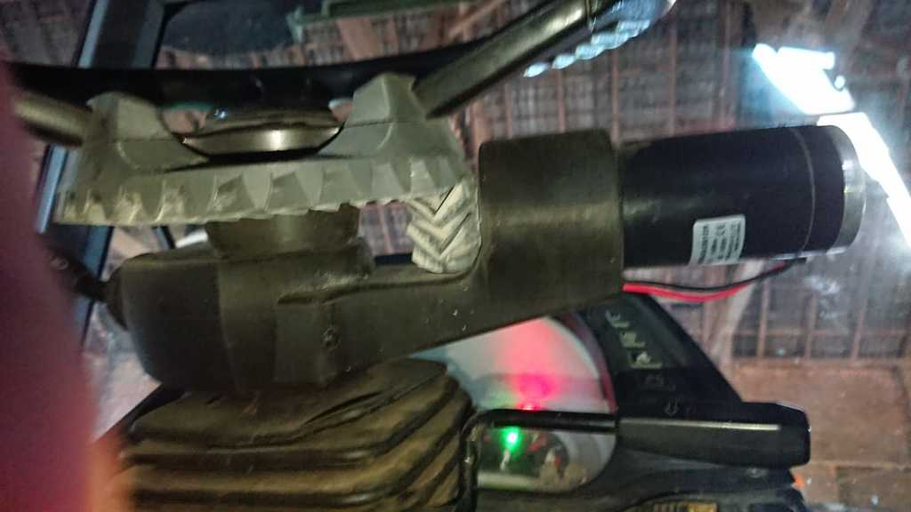
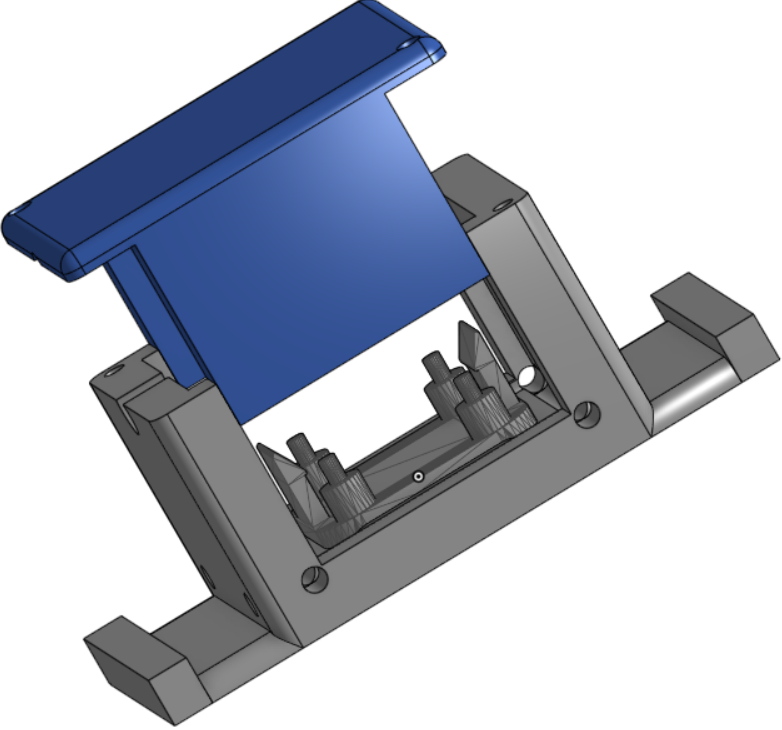
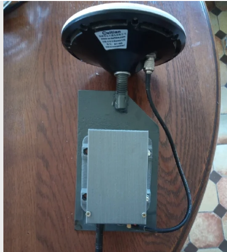

# Here's a list of some cool 3D prints you might find useful

### 3d print for steering for CVT/CVX  https://www.thingiverse.com/thing:6361474

----

[3D printable RQH100030 holder](https://discourse.agopengps.com/t/3d-printable-rqh100030-holder/15966)

---
[Various Ardusimple RTK mounts](https://www.printables.com/@ConradStenfte_621141/models)

---

[RPI4 and Sparkfun F9P case](https://makerworld.com/en/models/435284#profileId-340284)

---

## Holder for BNO085 outside AIO board (for mounting separately)

https://github.com/lansalot/AgOpenGPS-Tools/blob/main/STLs/bnorvclid.stl

https://github.com/lansalot/AgOpenGPS-Tools/blob/main/STLs/bnorvcbase.stl

---

# Quick transfer unit for antenna

https://www.thingiverse.com/thing:5182231

---

# Some great STLs on the French AOG wiki

https://www.aogwiki.fr/doku.php?id=fichiers_stl