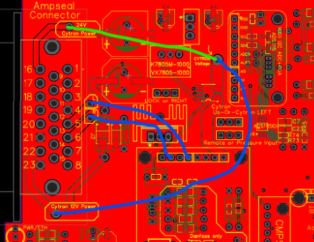

This page will aim to collect all the issues / fixes / improvements one can do having a v2.x board.

## Tougher traces

The Input diode can only handle 3A
Cytron can do a lot more than the traces

Using it via 24V is okay or with relays it's okay as well.

12V 5-6A motor however requires users to add some extra wires.

Micro:

Standard:

## Pressure Sensor

The AiO's pressure input was meant for 20mA sensors, the above should modify it for variable voltage input

Use the correct resistors as needed. For example, 5V input, use a 1:2 ratio (eg, R1 3k, R2 6k or 5k to be safe)
For 0-12V input, use a 3:1 ratio (eg, R1 6k, R2 2k)

Micro:

Standard:

## Can termination fix for Micro

## Free wheel mod fix

Standard:

Micro:

The reason for swapping the 330ohm to 1kohm is because linking PWM2 Cytron to Teensy with 10ma is too much - they recommend 4ma max.