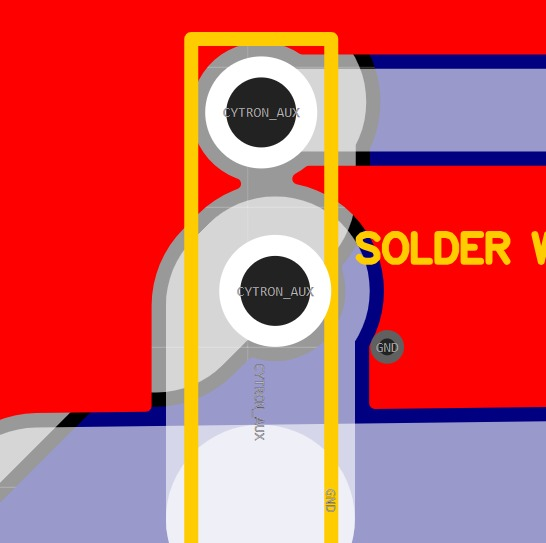
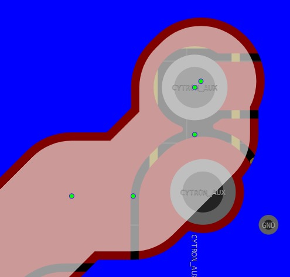
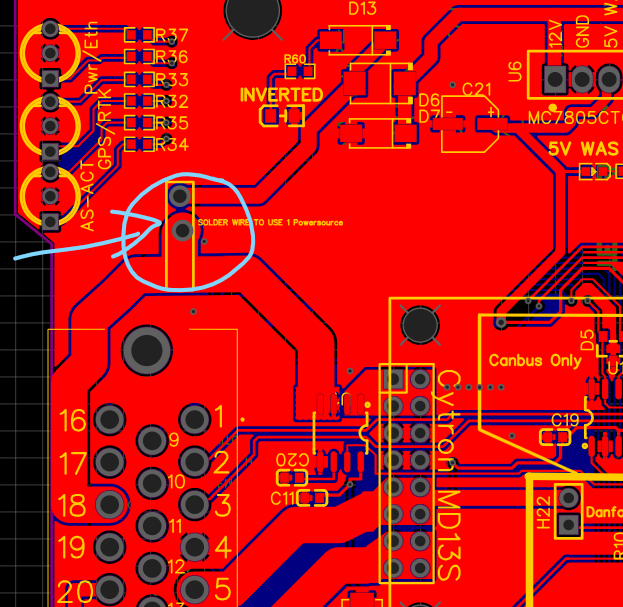

# _**These fixed are for v4.1 STD / Standard only**_

## v4.5 boards do NOT need these fixes!!

The trace next to the ampseal is touching the direct 12V input, so for 24V motors please cut the trace.
For valves / 12V motor the outside 12V pin will power your cytron directly. (so the label is misleading)

