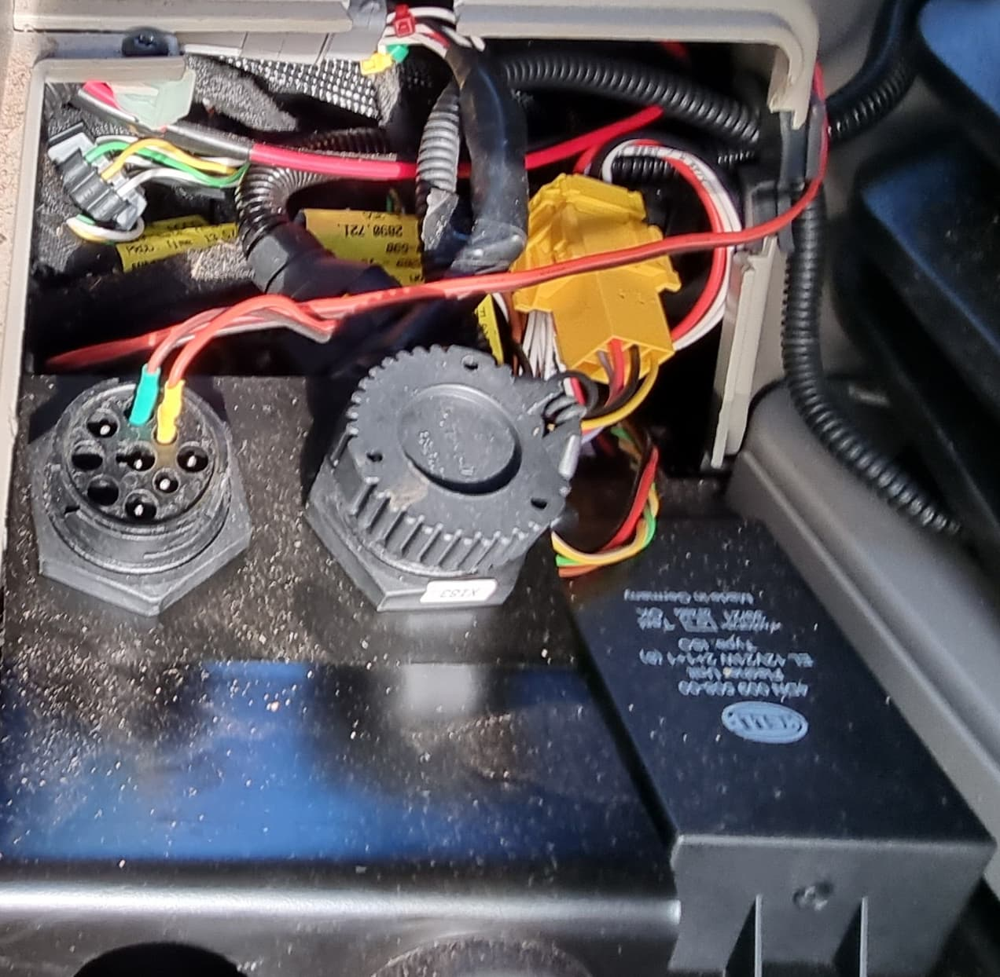
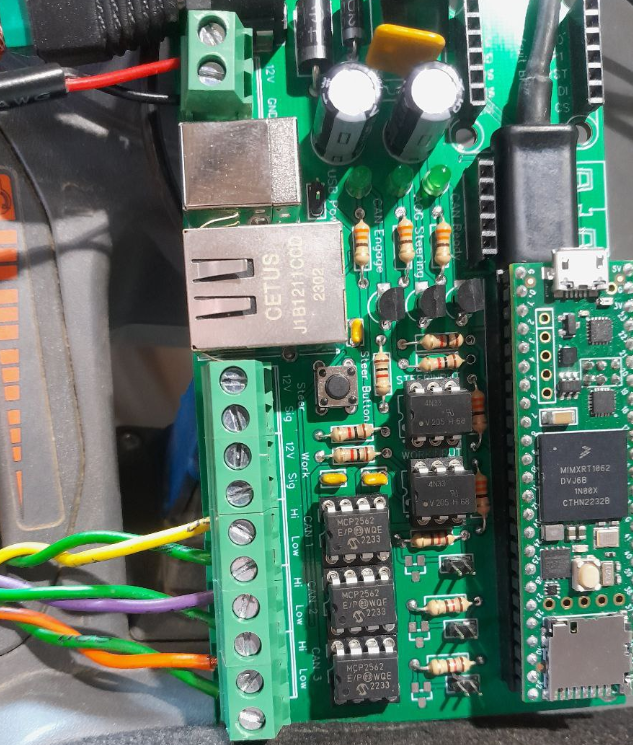

# CANBUS

CommonRail has written a superb guide on how to investigate the CANbus on your system - give it a good read!

https://discourse.agopengps.com/t/canbus-for-beginners-super-simple/3814/884

https://discourse.agopengps.com/c/hardware/canbus/33

[Here's a success story](https://discourse.agopengps.com/t/steering-a-22-mf-6718s-over-canbus/11955) using the AIO and CANBUS to control an MF 6718S

The Teensy has 3 CANBUS receivers on it, but you still need transceivers. The AIO 2.4 board has space for 2 transceivers and the 4.x boards have space for 1. The part you're looking for is https://www.mouser.co.uk/ProductDetail/579-MCP2562T-E-SN

These are absolutely tiny and you'll be soldering them on here most likely:

CommonRail has an excellent resource including the code you need [here](https://github.com/MechanicTony/AOG_CAN_Teensy4.1) on how to learn about CANBUS, and control your machine with it.

CAN connector pinout:

Massey Ferguson - steer bus location:

Fendt (V-Bus is for steering):

If you want to learn how to sniff the CANBUS and find out joystick codes etc, watch this: https://youtu.be/O01Fy4dBw6s