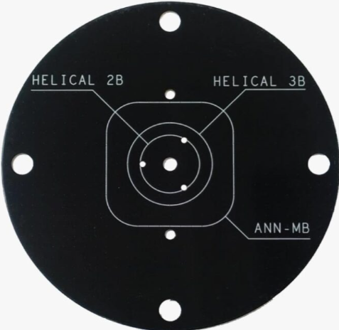

# Choosing an antenna

While Ardusimple offer such things as "calibrated" antennas for survey, you don't really need them. You have a choice to go either single or dual antenna - and the below antennas will work just fine.

https://www.ardusimple.com/product/ann-mb-00-ip67/

If you use this type, note that it needs some metal to back-reflect off of. A piece of metal around the size of a DVD is about right. Ardusimple even sell one, here: https://www.ardusimple.com/product/ground-plate-for-gnss-antenna/

Being not-bright-green-and-yellow, they hide on the roof of your machine really well. And they're that cheap, they're not even worth stealing. Can't quite say the same about your FireStarters, eh...!

These are also a great option, tho a bit more expensive and visible.

https://www.ardusimple.com/product/survey-gnss-multiband-antenna/

