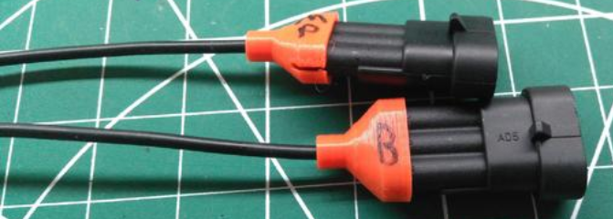
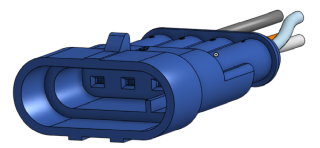

# Found any cool printables for connectors, boxes etc? List them here!

https://www.thingiverse.com/thing:4670391 - 3-pin superseal backshell

***

https://www.thingiverse.com/thing:2135524 - cap for 2-pin ampseal/superseal

***

https://discourse.agopengps.com/t/case-ih-puma-230-autosteer-ready/5592/73

40-pin DRC connector

***

Various SuperSeals you can print out: 
https://cad.onshape.com/documents/337a36e88011d4509228a1b3/w/b5ec0133bb1899b23d31672b/e/46bc86a9c34d6419d811949c?renderMode=0&uiState=6468ebfb9c20896398f33cc8
