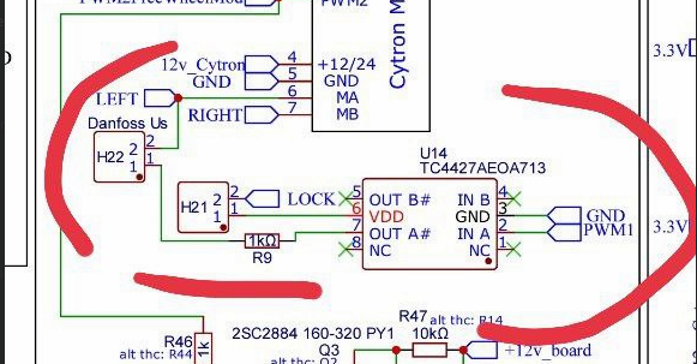
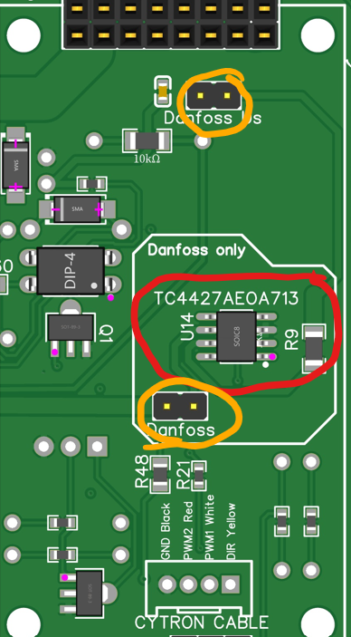
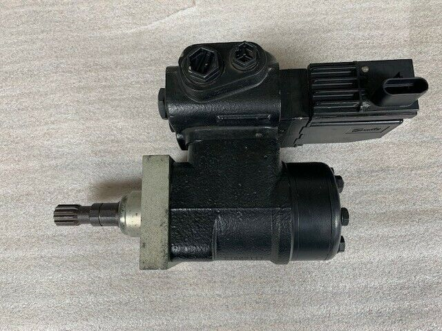
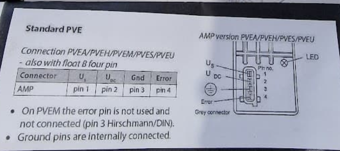

# Danfoss valves

The original Danfoss solution was a 3-wire installation.

The danfoss valve was the original integrated autosteer valve. They’ve been used by Deere, Agco, CNH, etc.

It would have been the easiest way for a tractor manufacturer to add an autosteer valve, the valve is built right into the steer motor. No additional plumbing is required. If you have one of these, you do not need a Cytron, but your board must have the TC4227 (PCB4.1) chip installed. JLCPCB will fit these to version 4 builds if they're in stock at time of ordering them.

Instead of sending a typical left or right PWM signal down separate channels, what they do instead is energise (or unlock) the Danfoss with the right channel and send a varying PWM signal down the left channel, where 50% is straight ahead, approx 15-25% is full left and 75-85% is full right (this is part of the safety systems to prevent shorts and such like causing unintended movement). Saying it again, the LEFT output therefore steers both left and right. Gnd must also be supplied of course. You should not power the lock via a relay, but drive from the board.

To use this configuration, your machine must have this kind of valve, you need the chip on the board and you need the jumpers positioned on the board at (picture).

Sample Danfoss plug guide, but check with your module!!

## Identifying a Danfoss valve

You can find the 4-pin connector on the [Connectors](https://github.com/AgHardware/Boards/wiki/Connectors) page
