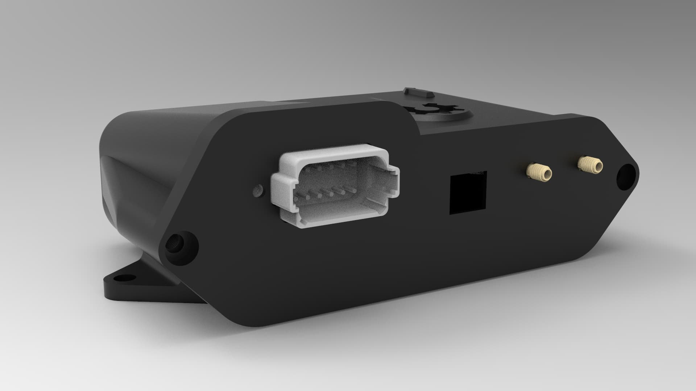
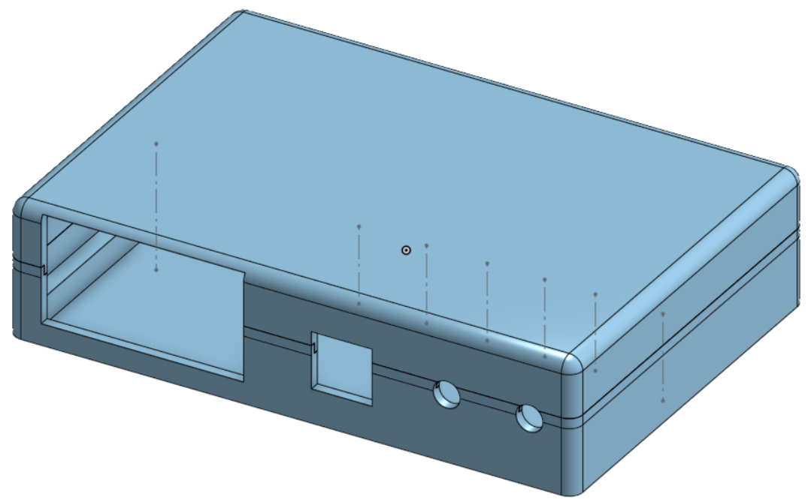
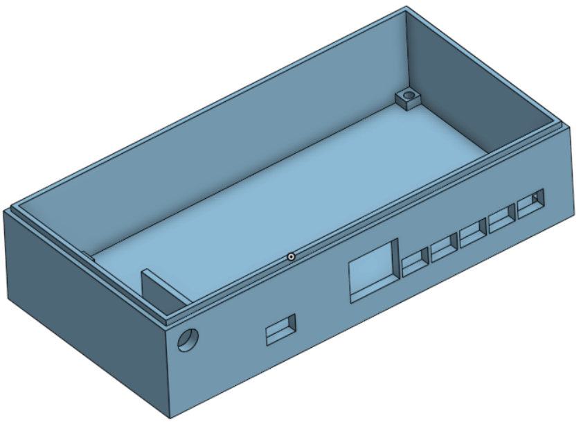

# Looking to print your own 3D case? Maybe you can find one you like here:

## PCBv4

## All-In-One (Micro)

Vili: https://discourse.agopengps.com/t/all-in-one-pcb/10444/5

## All-In-One (Standard)

https://discourse.agopengps.com/t/all-in-one-pcb/10444/5

***

Alternative low-profile Micro enclosure

https://cad.onshape.com/documents/2ce126543c19758e3f29edf2/w/d34558ff003526b410ea943b/e/2be4a9e5caed293fb7593442?renderMode=0&uiState=64fddd0654dfbf638e003ad1

***

## AOG Micro smaller enclosure

https://www.printables.com/model/555540-agopengps-micro-v41-smaller-enclosure

***

## Tony's CANBUS board

https://cad.onshape.com/documents/d3f169edb0b22d9a9912c541/w/56a7125e5876a5077e79faad/e/c9152ff253be9915b658e88c

***
## PCBv2

## PCBv2/PANDA

https://cad.onshape.com/documents/dc3f62615fb1a85d3175d2c0/w/0401663b852958d18d6917ca/e/9c55b48baedf869a35b040a1

## AOG 4.1 Std

https://www.printables.com/model/587713-enclosure-for-agopengps-pcbv41std-v3

https://www.printables.com/model/775428-enclosure-for-agopengps-pcbv4xstd-v4

***

# Enclosure for BNO085, for mounting outside your AIO case

https://github.com/lansalot/AgOpenGPS-Tools/tree/main/STLs

## Some useful small cases for projects here:

https://www.gainta.com/en/g302mf.html
https://gainta.com/en/g201mf.html
