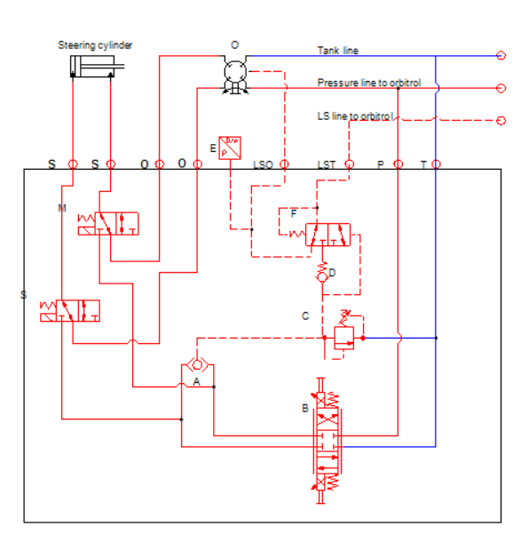
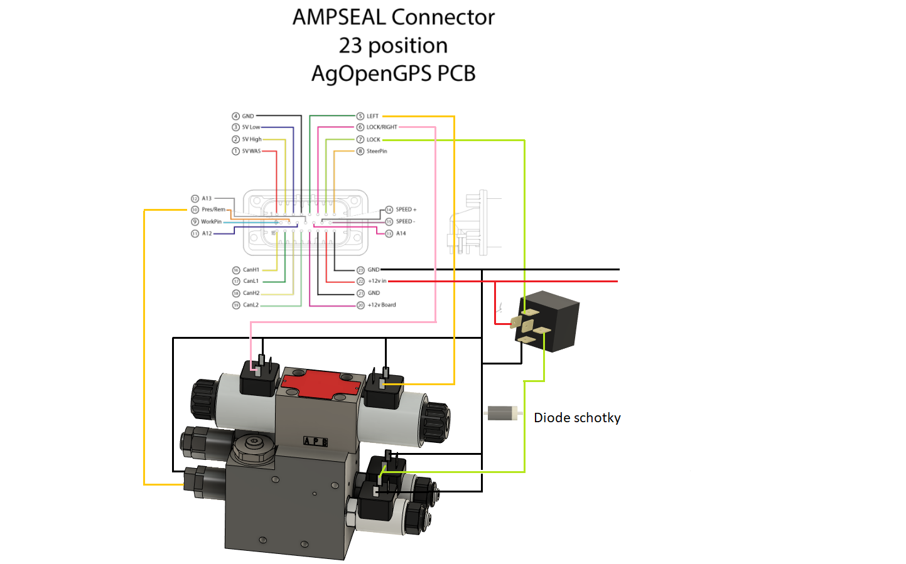
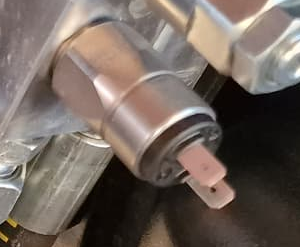
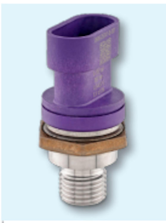
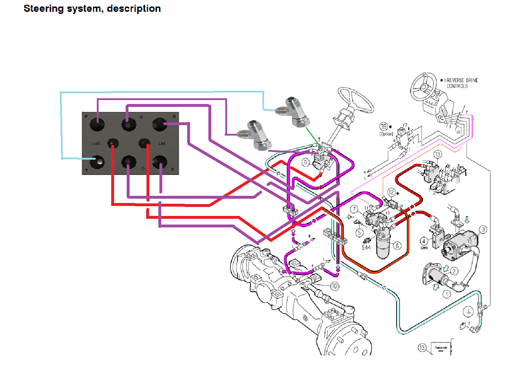
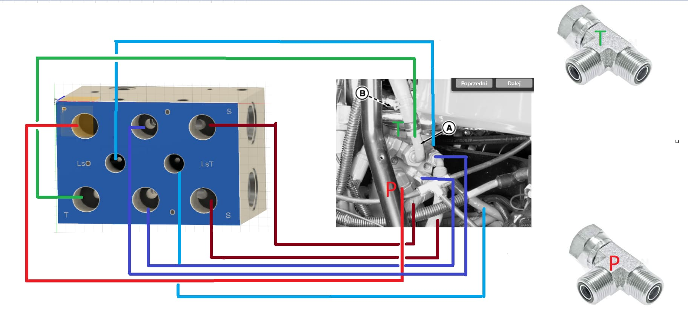
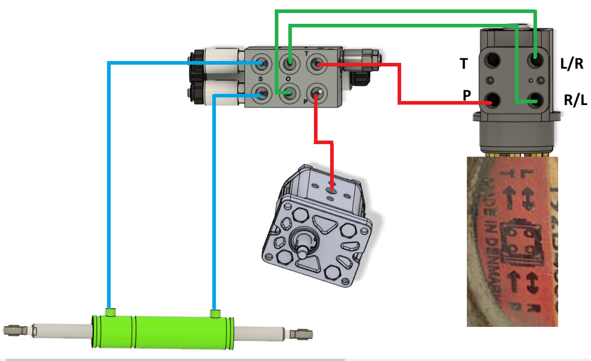
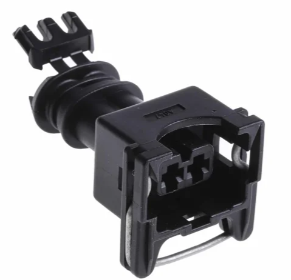

# Motor? Nah - hydraulic please!

This still needs Cytron MD13S :) but we'll move valves instead of motors

So, if your system is compatible, you can likely steer it directly without a motor turning the steering wheel.

Motor settings are follow:

  * Proportional gain - depends on the size of the piston:
    * 15 for small tractors
    * 40 for the big ones
  * The maximum Limit maxPWM - depends on the size of the piston 100-180
  * The minimum to move minPWM is 38-40

## How to choose a valve?
There are a few kind of valves depending on the Orbit installed. These are available in the shop: https://www.agopengps.pl/en/shop-1?currency=EUR

Take a look at your Orbitrol: 
  * 4 hoses then you'll need an [OC valve](https://www.agopengps.pl/en/product-page/zaw%C3%B3r-hydrauliczny?currency=EUR) and will be connected between the pump / steer lines.
  * 5 hoses will be an LS system and needs an [LS valve](https://www.agopengps.pl/en/product-page/zaw%C3%B3r-hydrauliczny-do-uk%C5%82adu-ls) with "Tee" connection and will be connected parallel to the P / T lines and between the LS / steer lines.
  * !!! some of the tractors require special valves, for example: 
    * Fendt (static) 
    * [John Deere 4XXX](https://discourse.agopengps.com/t/hydraulic-valve-assemblies-for-every-tractor-for-every-type-of-hydraulic-system/8011/586?u=bgunics) 
    * CASE Quadtrack (90L) require special valves !!! Double check on these. 

The valve flow depends on the tractor size. 150-200HP tractors will likely need 60liter. The forum might have tips from baraki. If unsure add a note about your tractor to the order!

https://discourse.agopengps.com/t/hydraulic-valve-assemblies-for-every-tractor-for-every-type-of-hydraulic-system/8011

## The valve itself:

Engineering drawings:
**OC**

Explanation: [Credit goes to Commonrail](https://discourse.agopengps.com/t/hydraulic-valve-assemblies-for-every-tractor-for-every-type-of-hydraulic-system/8011/578?u=bgunics)

* 2 is a logic valve, it basically makes a small LS closed centre system inside this valve block for the autosteer. This valve will keep the P line a few bar higher than the internal LS line (in other words a few bar higher than what is needed to operate the wheels at the current time)

* 1 is a relief valve used to limit the maximum pressure for the steering, when this valve is tripped the LS line can’t go any higher and the valve 2 will let the oil out the T port

* The pressure sensor is connected to the valve block T line, this line is connected to the P port of the orbital and because it is open centre the oil free flows to tank. But when you turn the steering wheel the pressure in this line rises as oil is needed to turn the wheels, because the orbital steering lines are blocked this pressure rises quickly and the sensor trips to tell autosteer to stop steering

**LS**

Special valve for Fendt:

## Installation
Electrical connection(s)

Theoretically the FET should be capable to handle the power to lock the valve. In practice we've seen smoke in some cases.
Best practice is to add a relay controlled by the Lock pin.

There are 2 kind of "pressure" check valves:
### Count type
The one with 2 pins needs to be connected between Ground and Pres/Rem connection. 
The sensor is a SUCO 166 416 0 31 063 NC

The PCB jumpers must be configured as Remote. 

AgOpenGPS must be configured as "Turn sensor" with value as "1". (it only clicks once)

### Pressure type
The one with 3 pins uses an AMP Superseal 3pn 1.5 connector and requires 5V from PCB (WAS 5V could be used). 

The sensor is:
0606-25209-B-007 Pressure Transmitter 
0 bar - 250 bar 0.5-4.5V
Ratiometric NPT1/4 AMPSuperseal
1.5 17-4PH Stainless Steel Cell

The PCB jumpers must be configured as Pressure. 

AgOpenGPS must be configured as Pressure with value accordingly.(~10% is equivalent as 0bar)

pinout is:
 - pin1 -> signal
 - pin2 -> GND
 - pin3 -> 5V

[AgOpenGPS software configuration is explained in detail here](https://github.com/farmerbriantee/AgOpenGPS/wiki/04.-AgOpenGPS-Orientation#steer-configuration)

### Installation of LS valve

### Installation of OC valve

# Installation example
Marek (maker of baraki valve) has a great set of pictures [here](https://photos.app.goo.gl/pQFi3ziAcnyhWgAR8) for installation on a Massey 5445

# Plugs that are of use

If you have the two-pin plug for left/right solenoids, you can use these (TE part 718-6867)  to connect:

https://uk.rs-online.com/web/p/automotive-connectors/7186867

If you want to use 3-pin plugs for the lock valves that have the schotky diode built in, use these Molex part S28200TC310R):

https://www.kempstoncontrols.co.uk/S28200TC310R/Molex/sku/457859

