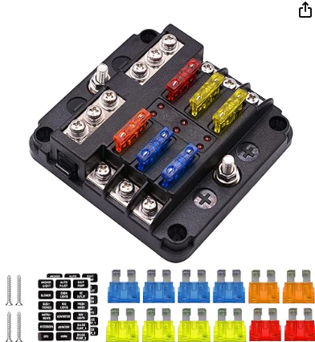
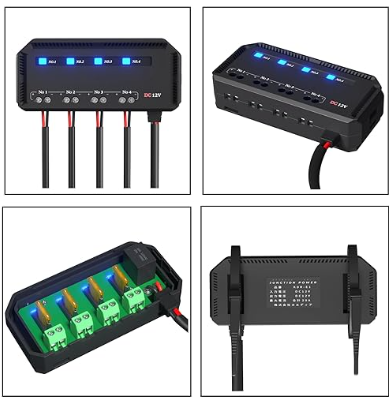

# Miscellaneous

### 5 volt network switch

### 12 volt network switch

### Teltonik TSW010 - industrial 12V switch
https://wiki.teltonika-networks.com/view/TSW010

### Power distributution

https://www.amazon.co.uk/dp/B07GYTZF35

https://www.amazon.co.uk/Kriogor-Motorcycle-Indicator-Headlights-Navigation/dp/B0BVVKJGFR

