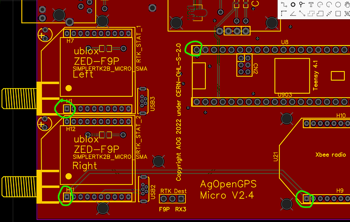

# Electrical testing and validation

## Tools needed:
* Multimeter as you want to measure that all the different 5V circuits are actually 5V and not 12V
* A laboratory power supply (30V 5A will do)
* easyEDA (as it's the easiest to read the board and traces there)

## Checking the main power rails

With the help of the labor supply we can do:
Connect the 2 leads together and minimize the amperes by configuring the ma A limit. Feel free to set this as 0.05A or so to start with. Then start with a low voltage (3V) and you should see pretty much no power draw.
Then going above 4 and 6V you should start to see moderate power draw as the board is energized. This is the point where you want to increase the A limit. Please note that the board with GPS installed will take about 2,5W of power that's 0.2A on 12V. If the motor is connected you might need 3A to operate the motor as well.

Minimum voltage and A check for shorts.
Then increase the Voltage and check if the voltage on the points are correct (and feel free to go all the way up to 14-15V as that's the max we can experience in the tractors)
Add the components then test them again for no excessive power draw.

#

# _If you're looking for a detailed guide on how to check PCB4.1, look here: https://discourse.agopengps.com/t/pcbv4-1-build-and-test/13722/1_

We have different regulators on the different boards, check accordingly.
* WAS -> 5V check for the WAS 5V rightmost visible pin on the ampseal from the back.

Micro:
Check for 3.3V and 5V on the circled pins, compare them to a grounding point. (New boards will have LED-s to assist)
Except teensy it should be 3.3V

ADS pin should be 5V as well

Standard:

Check for the following voltages:
* WAS -> 5V check for the WAS 5V rightmost visible pin on the ampseal from the back.
* 5V regulators for the GPS / Teensy / ADS / can

TODO more info on this, but here is a great guide on how to test your PCB before blowing anything expensive up:

https://discourse.agopengps.com/t/all-in-one-pcb/10444/233

## Avoid damaging your computer

NOTE: you should NEVER have your board connected over USB and powered up over 12V at the same time! There is risk of damage to your USB port if you do.

### Option 1 unplug
Unplug the Teensy from the board whenever you send new code to it, but that means you can't safely live-diagnose the board over USB while it's powered up.

### Option 2 cut
Cut the trace on the underside of the Teensy, so that way you have the ability to diagnose any Teensy issues over USB safely while the board is powered over 12V:

The downside of that is you'll need to remake the joint if you want to power the Teensy _only_ over USB again.

### Option 3 USB isolator