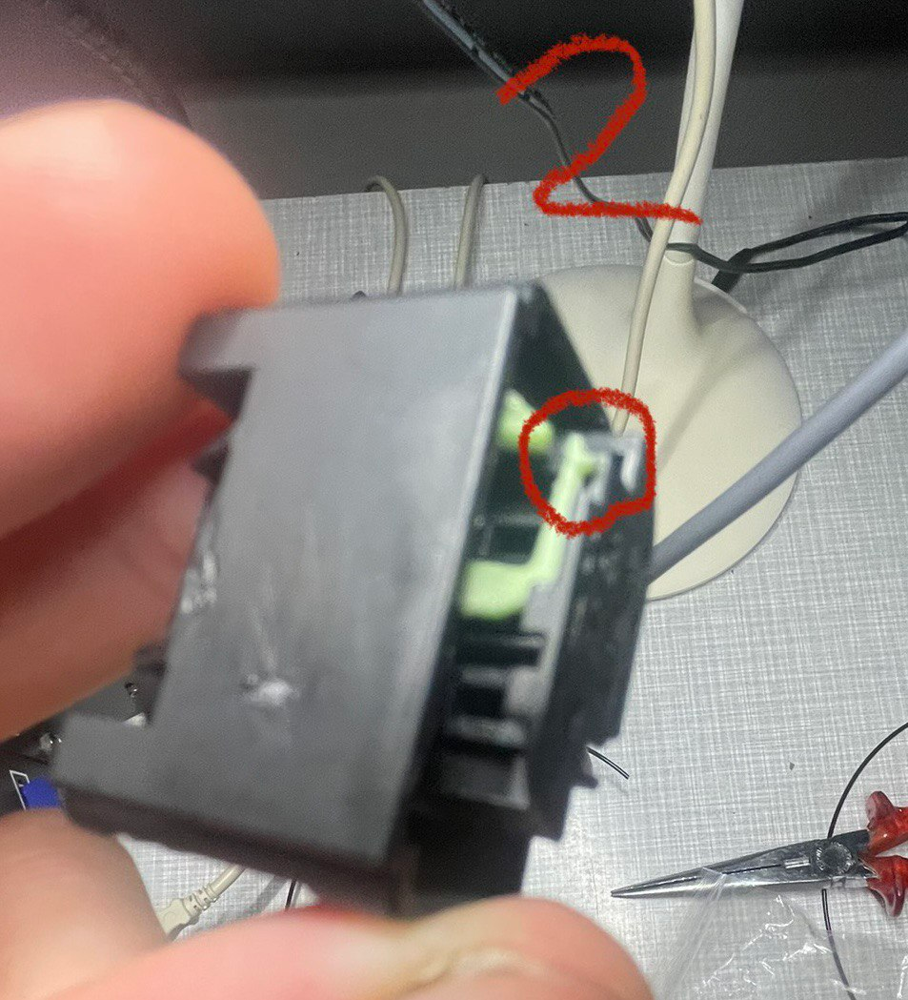
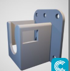
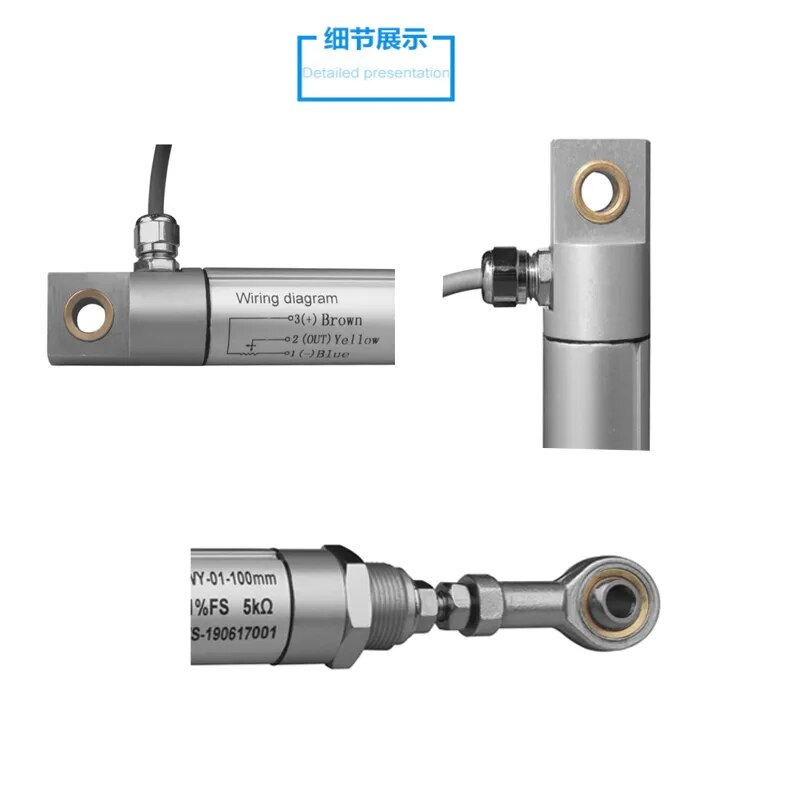
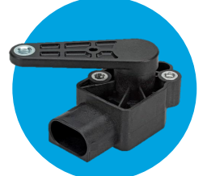
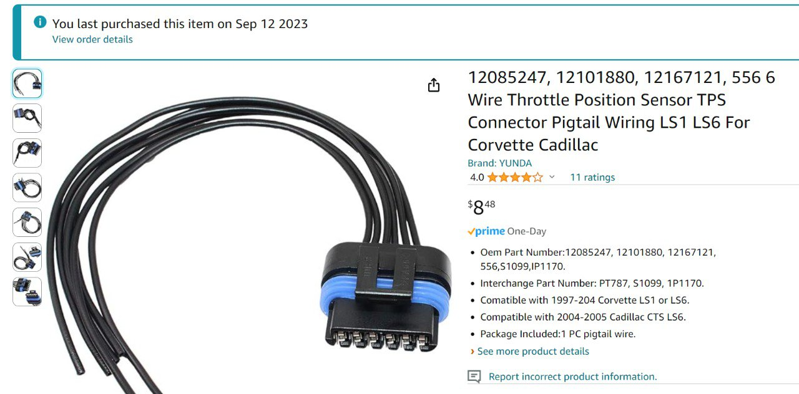

# Wheel Angle Sensor

It's the job of the wheel angle sensor to tell AOG which direction the wheels are pointing. If you already have one on your machine, you might find you can use it instead. Check out the Discourse forum for more on that. If you can't use it, or there isn't one, you can use one of these to provide the info to AOG. Having wheel direction information (no matter how it's provided) is critical, you can't skip this.

## Land Rover suspension height sensors are popular here and they're pretty cheap brand new on ebay.

You should also get a wiring harness plug for it:

This is how it looks on the tail - you will need
- pin 5 (5V) going to Ampseal Pin 1 (5V WAS)
- pin 4 (signal/output) going to Ampseal pin 2 (5V High)
- pin 1 (GND) going to Ampseal pin 4 (GND)

Good video explaining the LR WAS here: https://www.youtube.com/watch?v=4GPAt9eeeNA

If for any reason your plug is wired incorrectly, you can re-pin it like this (via "P R" on Telegram):

"There is a green lock take a small screwdriver and push it to the side. Now you can pull at the cable and the pin comes out if you did bad crimp you can use the screwdriver for push the pin from the front"

Sensor + plug also available on Aliexpress if you have time.

There's a lot of great ideas on how to mount your wheel angle sensor here:

https://discourse.agopengps.com/t/wheel-angle-sensor-installation-examples-lots-of-pictures/10163

Also, there's a handy STL you can print that your LR sensor will just slip into here: https://github.com/lansalot/AgOpenGPS-Tools/blob/main/STLs/LandRoverWASHolder.stl

(Please advise who made this, so credit can be given - it was found months ago and no idea who made it. Likewise, if you would prefer it removed, please let anyone in the Telegram chat know)

## Linear sensor:
https://a.aliexpress.com/_EzWvmn1

## Kyocera AVX
9168000010

* https://eu.mouser.com/ProductDetail/KYOCERA-AVX/9168000010

Connector (same as land rover):
* https://eu.mouser.com/ProductDetail/TE-Connectivity-AMP/1-967616-1
* https://eu.mouser.com/ProductDetail/TE-Connectivity-AMP/5-965906-6
This is how it looks on the tail - you will need
- pin 1 (5V) going to Ampseal Pin 1 (5V WAS)
- pin 4 (signal/output) going to Ampseal pin 2 (5V High)
- pin 2 (GND) going to Ampseal pin 4 (GND)

## Kyocera AVX with arm
9197000010

- pin 5 (5V) going to Ampseal Pin 1 (5V WAS)
- pin 4 (signal/output) going to Ampseal pin 2 (5V High)
- pin 1 (GND) going to Ampseal pin 4 (GND)
Connector (see above same as land rover)

https://www.conrad.com/en/p/kyocera-avx-hall-effect-sensor-9197000010-4-75-5-25-v-reading-range-45-45-amp-plug-2826994.html?searchType=SearchRedirect

John Deere sensor (can be used on anything ofc, and probably costs extra coz the JD tax). Note however, that these sensors are spring-loaded, which will take up any slack and are thus a good option. If you search for A-RE575331 or I-RE575331, you'll find it cheaper.

Its a Sensata BEI 9360, Deere RE575331, A&I A-RE575331.

Deere often calls it a hydro handle sensor but they also use it as a WAS.

https://www.sensata.com/sites/default/files/a/sensata-9360-series-rotary-position-sensor-datasheet.pdf

The 6 pin Metripack that it uses is the same as used by GM for LS1 and LS6 engine TPS sensors.

If you give the auto parts store (or amazon, rock auto, etc) any of these numbers they should be able to come up with a pigtail. 12085247, 12101880, 12167121, 556

----

These are a great option for combine harvesters, easily hidden under or behind the ram where there's usually plenty of space

## Available in different lengths, so make sure they match at least the amount of exposed steering ram when you're at full lock, or you'll rip it out the end

