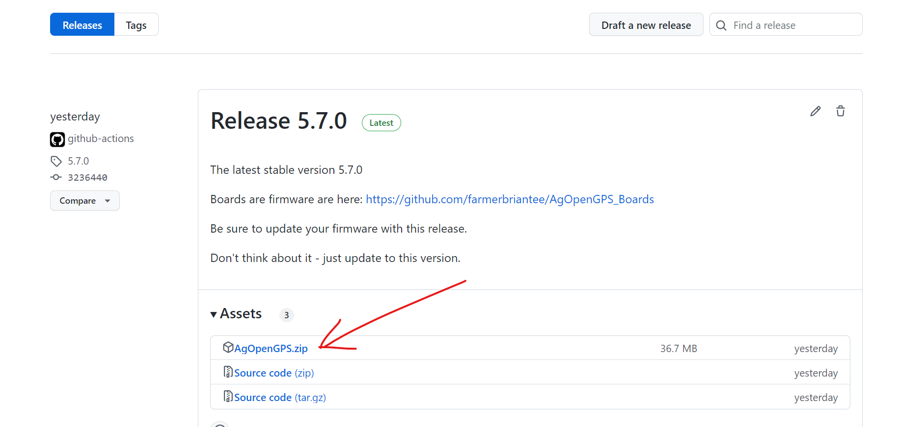
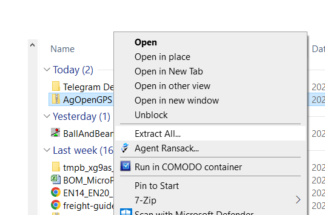
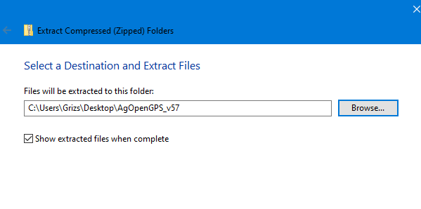
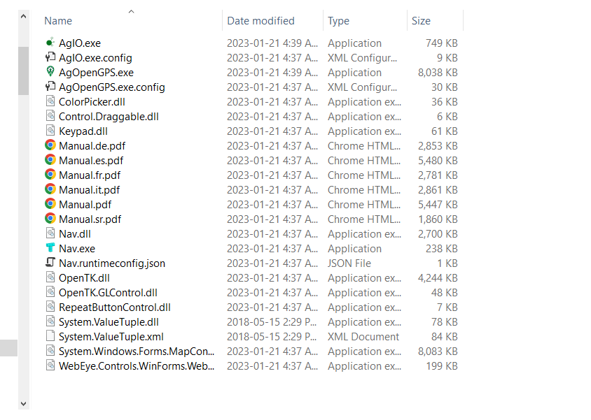
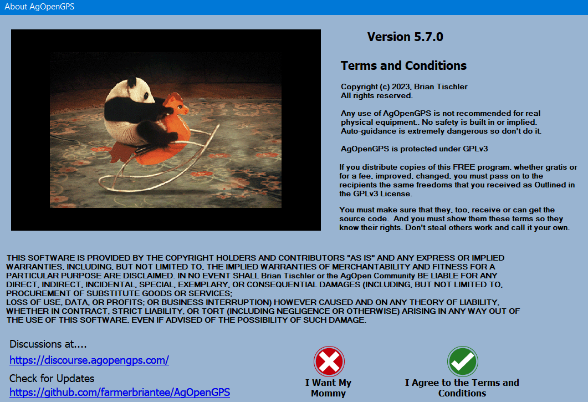
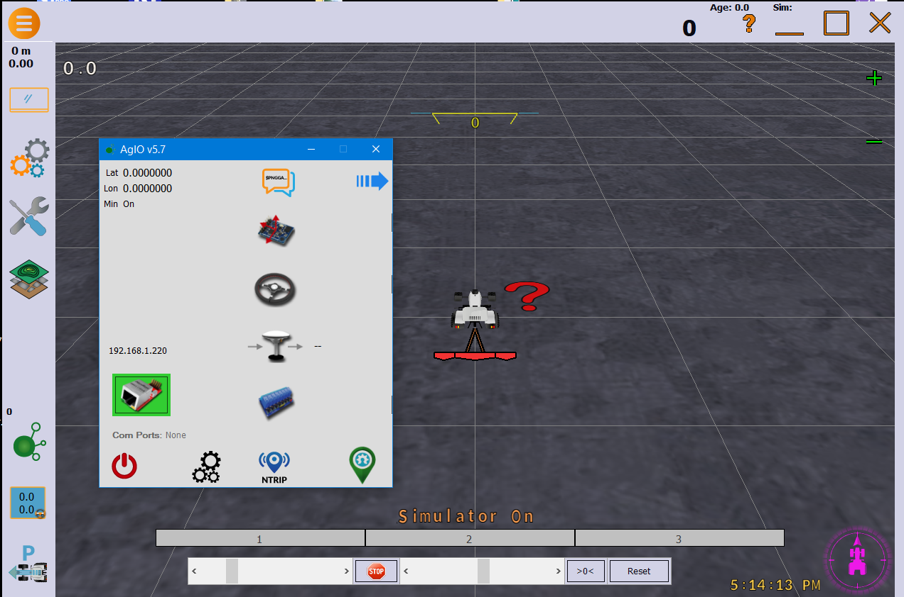

# Installing and running AOG

There's a video here showing this process: https://www.youtube.com/watch?v=WiyDXU-lgrM

***

Or you can follow this guide:

Go to this Page for the latest Release: [RELEASES](https://github.com/AgOpenGPS-Official/AgOpenGPS/releases)

Click on "The Latest"

Download the Zip File AgOpenGPS v5

Go to your downloads folder to find the zip, then right click and select unblock - this tells windows it is safe

Right click and select "Extract"

Put the folder on your desktop (Or anywhere you wish) and extract

This is the folder of files. You need to Run AgOpenGPS.exe so double click on it.
You can make a shortcut to it on your desktop - no installation required.

Read and agree to the terms - or not

If you see AgIO and AgOpenGPS - you are good. 

AgOpenGPS and AgIO can be run independently as well. There are icons to start the other if not running.

