## Main Menu

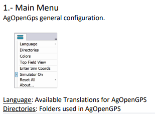

## Display Option

If (10) is consistently below 10 (and especially if it's at 1), you may have your ublox set incorrectly.

## Main Configuration

1. Vehicle Configuration

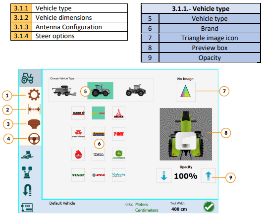

2. Vehicle Dimensions

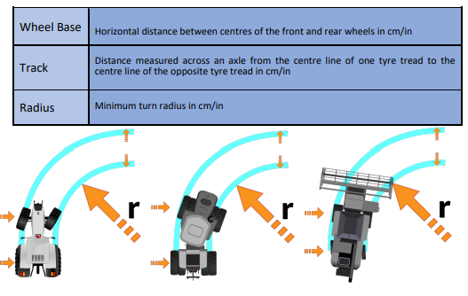

3. Antenna Configuration

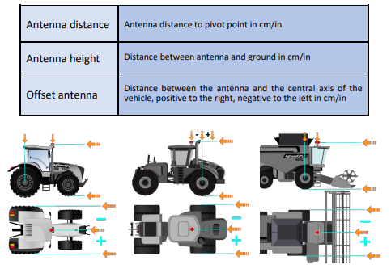

4. Steer Options

5. Implement Configuration

6. Attachment Configuration

7. Sections TODO

8. Attachment Options

For (1), top to bottom, they are:
- Time to turn on the section early before getting to the unapplied area (for start of row)
- Time to shut sections off, before getting to the applied region (for end of row)
- Time to keep going after applied area says they should turn off

9. Work Switch Configuration

If Work switch is enabled, then choose if you'd like to have it engage manual or auto-sections. Similar for Steer switch.

Toggle at the bottom is for if you want "work" to be counted when the work switch is on, or off.

10. Sources Configuration TODO

11. Roll Configuration

12. U-Turn Configuration

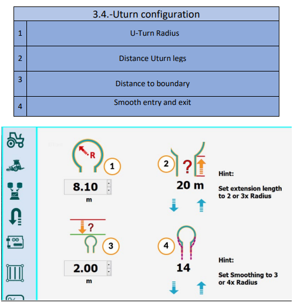

(1) the radius you can comfortably make a turn in, without binding the machine/drawbar/tractor/PTO etc

13. Arduino Machine Module Configuration

14. Pin Configuration

15 Tram Lines Configuration.

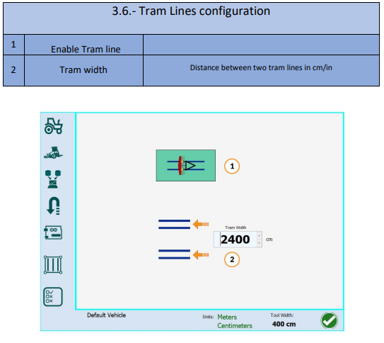

16. Icons and Sounds Configurations.

## Utilities

1. Steer Setup Wizard

2. Charts

3. Smooth AB Curve - takes out the noise

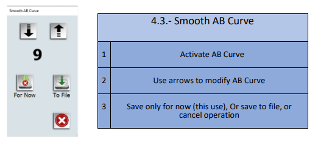

4. Delete Contour Paths

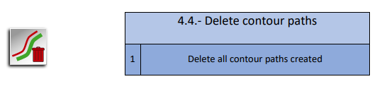

5. Delete Applied Area

6. Webcam

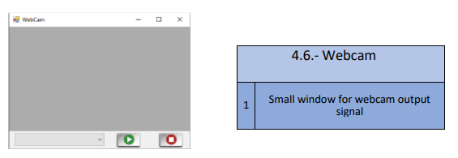

7. Offset Fix

## Field Menu Button

1. Start New or Open Fields

## Field Menu - Field Open

1. Field 

2. Boundary 

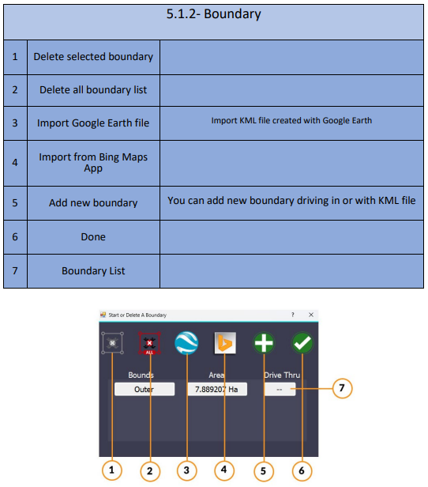

3. Headland

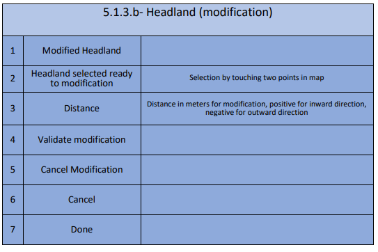

4. Tramlines

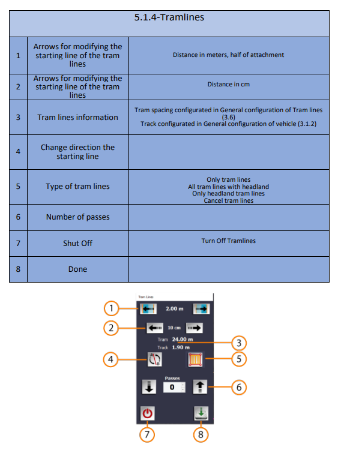

5. Boundary Contours

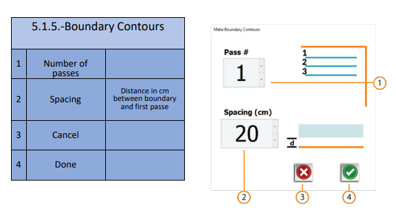

6. Recorded Path

## Steer Configuration

1. Steer Settings

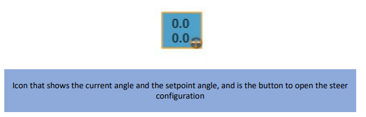

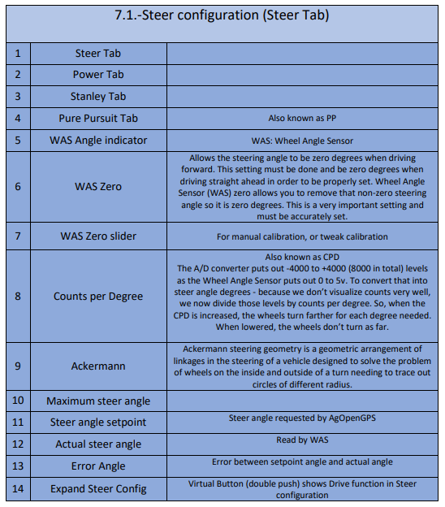

2. Gain Configuration

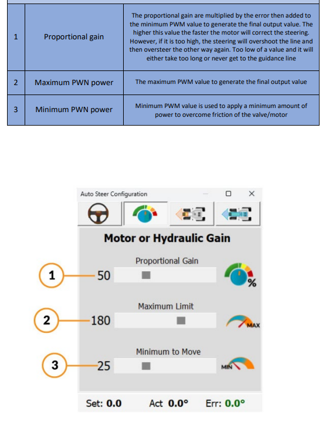

3. Stanley Settings

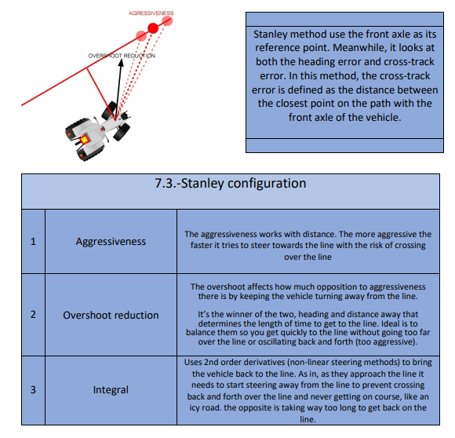

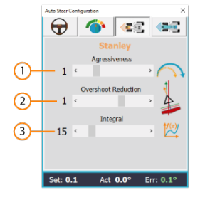

4. Pure Pursuit Settings

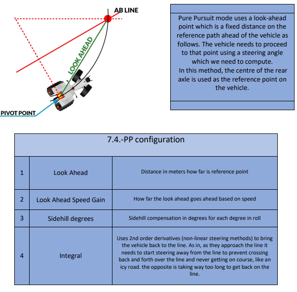

5. Drive and Test

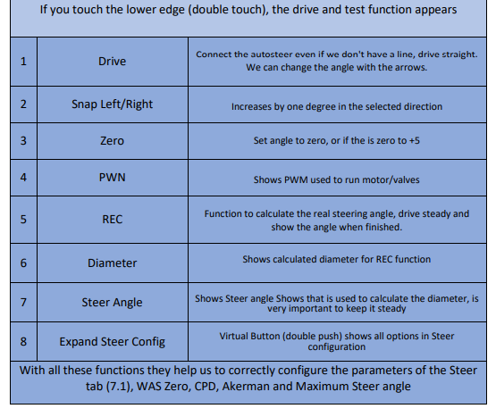

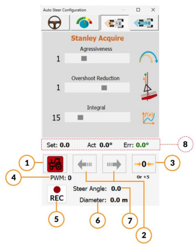

6. Steer Module Configuration

7. Steer Mode

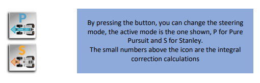

8. Steer Indicator

## Field Open Main Display

1. Right Side

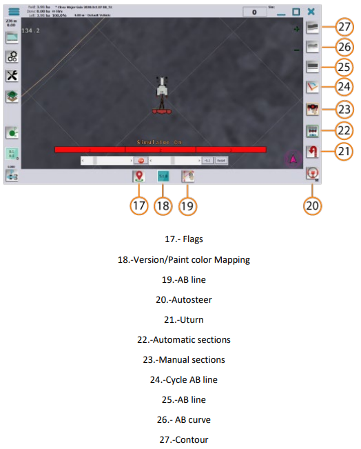

2. Functions for AB Line Selected

3. Flags

4. Version / Section Paint Color

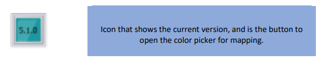

5. Color Setting

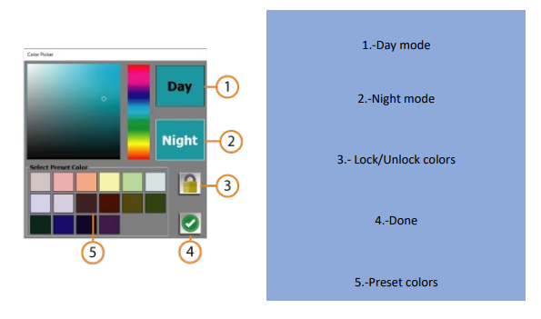

## Guidance Lines

1. AB Line

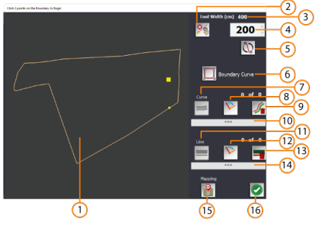

2. Autosteer Control

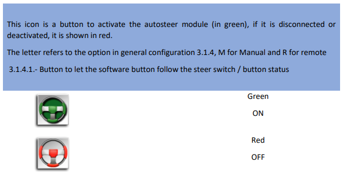

3. U-Turn Control

4. Create AB Line or Curve

5. Create AB Line

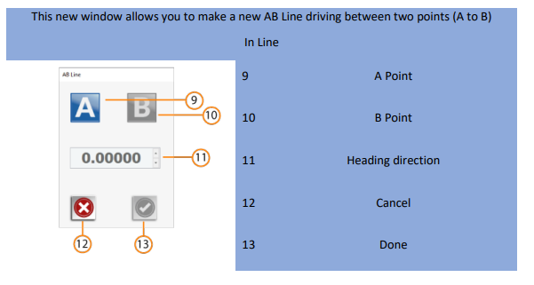

6. Create Curve

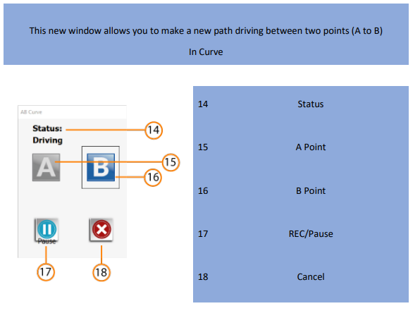

7. Contour

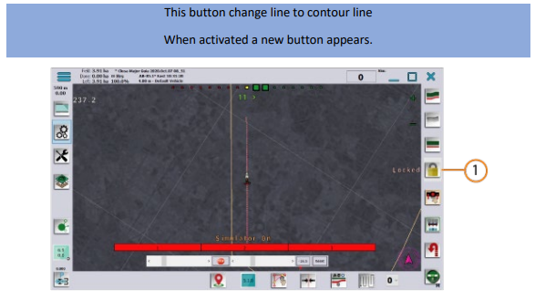

8. Snap to Pivot

9. AB Line Edit

10. U-Turn Skips

11. Headland Control Buttons

