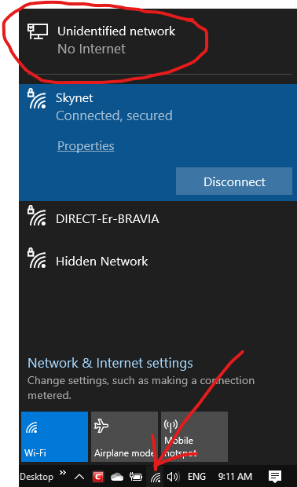
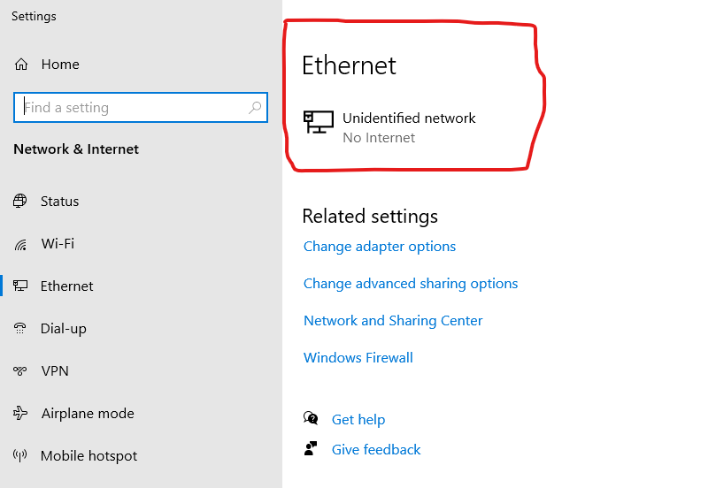
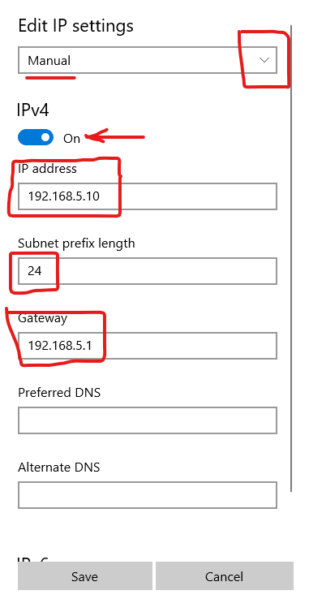
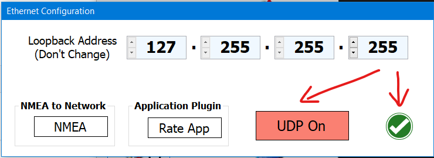
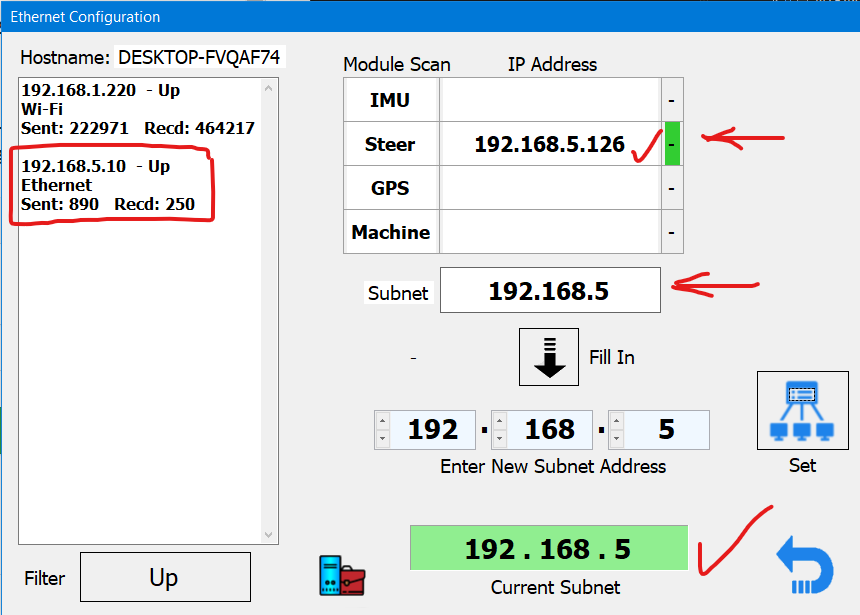
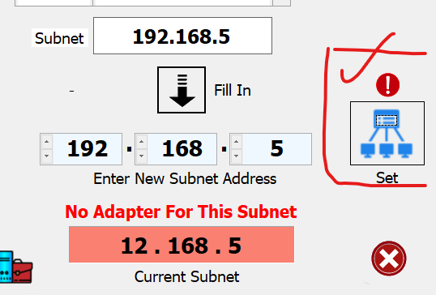
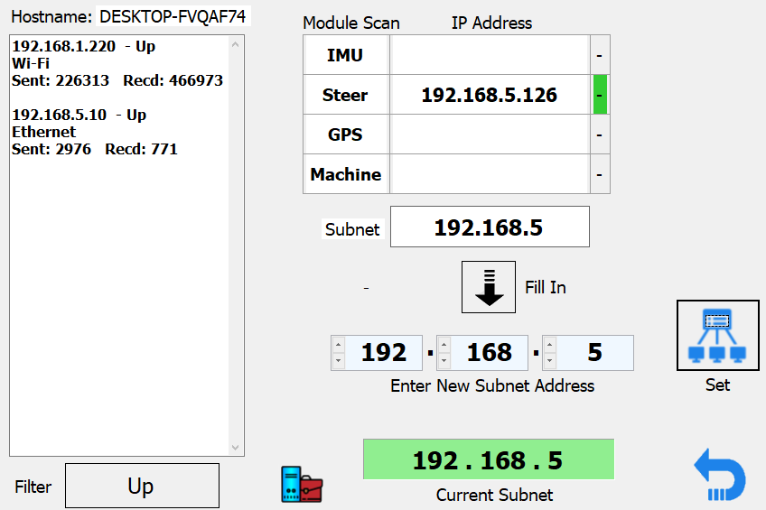
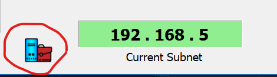

Ethernet setup requires a hardwired connection from your computer to the module. If you have more then one module to connect to you need an ethernet switch as well - like a powerbar for networking. You cannot run more then 1 adapter on a subnet. 

[Watch YouTube Video on Setting Ethernet](https://www.youtube.com/watch?v=kb54ZQuGYJE)

1. You need to decide on your subnet. The subnet is like a telephone area code. It allows the same phone numbers in many other area codes and groups them. If you don't already know what your subnet is or should be, just use 192.168.5. The subnet mask is 255.255.255.0 meaning there is 255 possible addresses in the "area" of 192.168.5

2. Make sure your ethernet cable is connected to the module and everything is powered on. 

3. Easy way to do this. At the bottom right touch the networking icon (could be wifi or wired icon) to bring up the networking summary. Now touch the network connection attached to your modules. 

4. Touch the network adapter you want to edit

5. Touch Edit

6. On the pulldown list select Manual. Turn on IPv4. 

7. Enter the full IP address that is your subnet and an unused IP. 192.168.5.10 in this case. You can of course enter any subnet you wish, although there are a few restrictions like 127... and 255.... 

8. Enter the subnet prefix length. 24 is 24bits of mask which is the same as typing in 255.255.255.0 - but is much shorter. Enter 24.

9. Enter a gateway - it isn't needed but something has to be there so enter subnet + 1. 192.168.5.1.

10. Be sure IPv6 is off. Touch Save. 

11. Touch this icon and it will bring up Ethernet Dialog as below:

12. Touch UDP On so it is green, touch OK. Don't change loopback unless you know exactly why you are for Linux. AgIO restarts and the ethernet should be green. 

13. Here you can see my active networks, a wifi connection 192.168.1.220 and our wired ethernet AgIO connection 192.168.5.10. Now touch the ethernet config button again to start the scanner and Subnet dialog. 

14. Here you can see our Ethernet adaptor 192.168.5.10 is up (connected and talking), the module address and status as talking, and the current subnet from the modules matches the subnet of the adapter. Everything is good. 

15. Now let us really mess it up. I will change the module subnet to 5.168.5 and the AgIO subnet to 12.168.5 and we will fix it. 

16. Nothing works and everything is red and all is wrong. But since our network adapter we did first was set to 192.168.5 we know that is what everything needs to be. The arrow points to Fill In and Subnet. The scanning shows the incorrect module subnet (5) and also the current subnet (12) are wrong. So all we need to do is touch the Fill in Button to load up the correct subnet from the adapter and hit the Set button.

17. Now touch the Set button and give it a few seconds - and it should all work. 

18. And it does. You can see the subnet that AgIO and the modules use matches the one we set in the Network adapter setup. Again, always set the adapter first! 

19. Touching the Network Properties icon brings up the old school network applet from control panel. This is another way to set the subnet etc - the long way. You are done if you did as above. 

20. Touch your network icon connected to your modules. 

21. Touch Properties, then scroll down and select "Internet Protocol Version 4 (TCPIP/IPv4) - but don't uncheck it accidentally.

22. Touch "Use the Following IP Address" Radio button, put in the IP Address 192.168.5.10, the mask, except instead of 24 for mask you have to put in the full 255.255.255.0. , and the Gateway 192.168.5.1. Now Touch ok, ok, Close. All done. The main AgIO should show the network, Ethernet scan should show all the rest.  

# Does your wifi drop when you connect to AGIO?

If so, that can be because Windows is prioritising the physical connection over the wifi and disabling it. In the case of AgOpenGPS, we need both. If you find that is happening, you may need a small registry fix to prevent that. You can download [the file here](https://raw.githubusercontent.com/AgOpenGPS-Official/Boards/main/Misc/Network-Drop-Fix.reg), double-click it to import to registry, or make the change yourself as guided [here](https://discourse.agopengps.com/t/toughpad-book/399/110)
