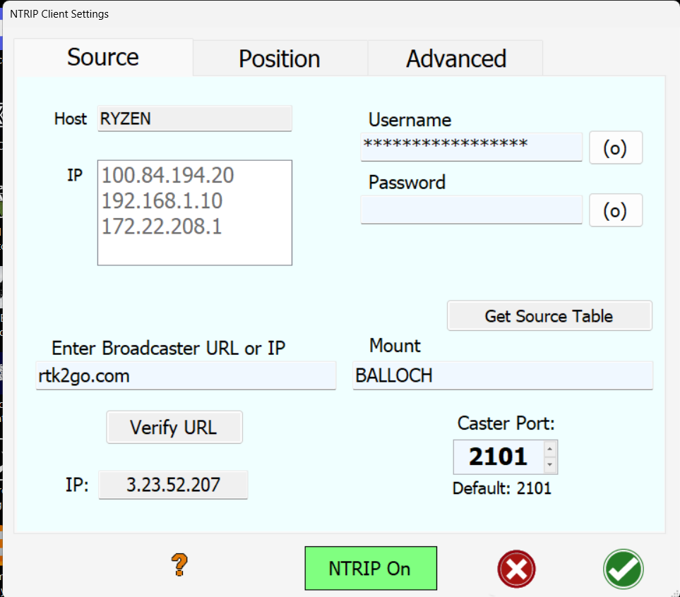

# Frequently asked questions / problems and solutions

## AgOpenGPS

* When running, my machine position shakes even when I'm not moving
  * Check that your F9P is updated correctly [here](https://github.com/farmerbriantee/AgOpenGPS_Boards/wiki/configuring-the-zed-f9p)
  * Check that it's outputting at the right resolution/frequency (figure at the bottom showing 10 - if it's one, configure F9P properly)

  * Ensure the antennas have a good view of the sky and that NTRIP is enabled and sending corrections over UDP (or serial, if using USB)

  * If using UDP, do NOT have USB connected at the same time. UDP is preferred, so disconnect all USB connections

